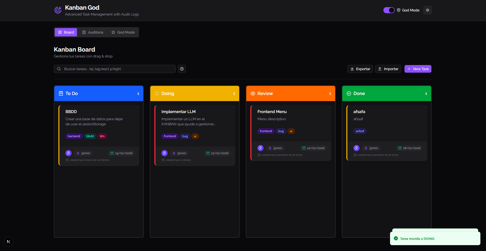
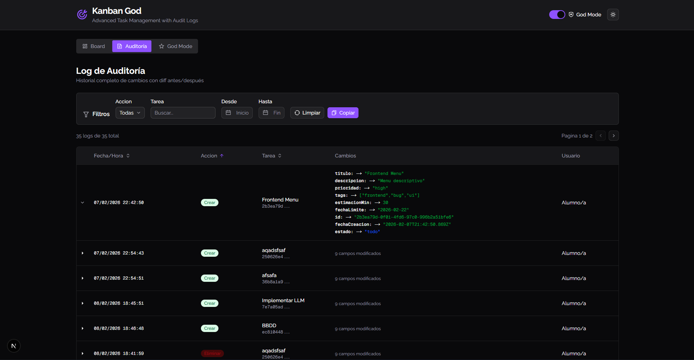
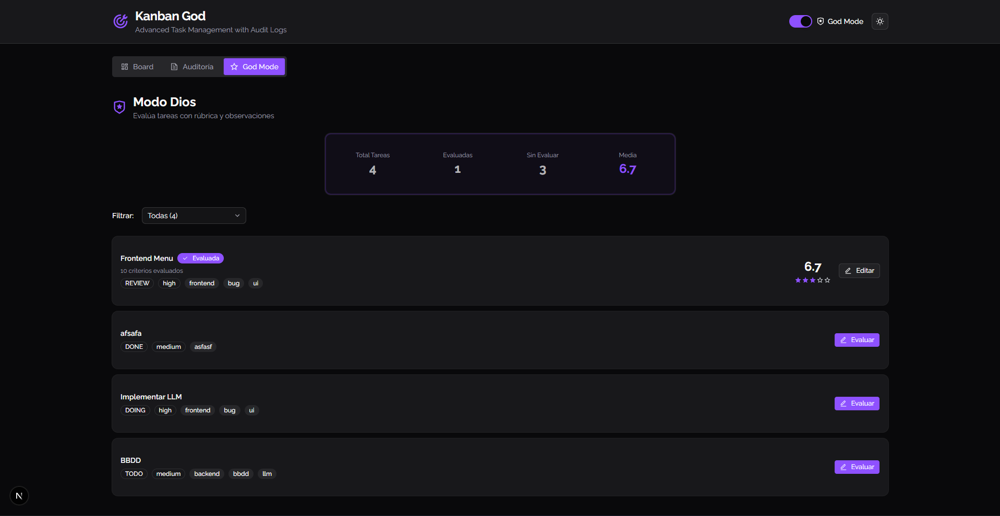

# Kanban God - Advanced Task Manager

Advanced Kanban board with audit logs, advanced search operators, and God Mode evaluation system.

**Enlace Vercel:** _[Pendiente de deploy]_

## Objetivo

Gestor de tareas tipo Kanban con funcionalidades avanzadas:
- ✅ Kanban completo con drag & drop
- ✅ Sistema de auditoría con diff (antes/después)
- ✅ Búsqueda avanzada con operadores
- ✅ Persistencia en localStorage
- ✅ Export/Import JSON con validación
- ✅ Modo Dios con evaluaciones 0-10

## Cómo usar

### Instalación

```bash
npm install
npm run dev
```

Abrir [http://localhost:3000](http://localhost:3000)

### Uso básico

1. **Board**: Crea tareas con el botón `+` en cada columna
2. **Drag & Drop**: Arrastra tareas entre columnas (Todo → Doing → Done)
3. **Búsqueda avanzada**: Usa operadores como `tag:react p:high due:week`
4. **Auditoría**: Consulta el historial completo de cambios
5. **God Mode**: Activa el switch y evalúa tareas con rúbrica 0-10

## Capturas

### 1. Kanban Board con Drag & Drop


### 2. Auditoría con Diff


### 3. Modo Dios


## ✅ Checklist de Requisitos

### Funcionales
- [x] Kanban con 3 columnas (Todo, Doing, Done)
- [x] CRUD completo de tareas
- [x] Drag & drop funcional (@dnd-kit)
- [x] Modelo de datos completo (id, titulo, descripcion, prioridad, tags, estimacionMin, fechas, estado)
- [x] Auditoría con diff (CREATE, UPDATE, DELETE, MOVE)
- [x] Vista de auditoría con tabla y filtros
- [x] Búsqueda avanzada con operadores (tag:, p:, due:, est:)
- [x] Persistencia en localStorage
- [x] Export JSON (descargar archivo)
- [x] Import JSON con validación completa
- [x] Modo Dios con evaluaciones 0-10
- [x] Panel resumen con estadísticas

### Técnicos
- [x] Next.js App Router
- [x] TypeScript sin `any`
- [x] Shadcn UI + Radix
- [x] Validación con Zod + react-hook-form
- [x] Separación: types.ts, lib/storage.ts, lib/query.ts
- [x] Accesibilidad (aria-labels, navegación teclado, focus visible)
- [x] Estados vacíos bien diseñados
- [x] Mínimo 10 commits significativos

## Decisiones Técnicas

### Arquitectura
- **Context API** para estado global en lugar de Redux/Zustand por simplicidad y menos boilerplate
- **localStorage** directo sin abstracción adicional - suficiente para el scope del proyecto
- **Componentes funcionales** con hooks - más modernos y composables

### Parser de Queries
El parser (`lib/query.ts`) tokeniza la búsqueda en operadores y texto libre:
```typescript
"tag:react p:high urgent" →
{
  operators: [
    { type: "tag", value: "react" },
    { type: "priority", value: "high" }
  ],
  freeText: "urgent"
}
```
Luego aplica cada filtro secuencialmente sobre el array de tareas.

### Diff de Auditoría
El diff se calcula comparando valores antes/después usando `JSON.stringify`:
```typescript
diff.push({
  field: "prioridad",
  before: "low",    // valor anterior
  after: "high"     // valor nuevo
})
```
Esto permite un historial completo y reversible de cambios.

### Drag & Drop
Usamos `@dnd-kit` con:
- `useDraggable` para tarjetas
- `useDroppable` para columnas
- `DragOverlay` para feedback visual

La clave es que `onDragEnd` llama a `moveTask()` que automáticamente registra el cambio en auditoría.

## Dependencias Principales

```json
{
  "dependencies": {
    "@dnd-kit/core": "^6.3.1",
    "react-hook-form": "^7.71.1",
    "zod": "^4.3.6",
    "uuid": "^13.0.0",
    "sonner": "^2.0.7",
    "date-fns": "latest",
    "next": "16.1.6",
    "react": "19.2.3"
  }
}
```

## Stack Tecnológico

- **Framework**: Next.js 16 (App Router)
- **UI**: Shadcn UI + Radix UI
- **Validación**: Zod + react-hook-form
- **Drag & Drop**: @dnd-kit
- **Notificaciones**: Sonner
- **Estilos**: TailwindCSS 4
- **TypeScript**: Strict mode, sin `any`

## 👤 Autor **msgserna**


